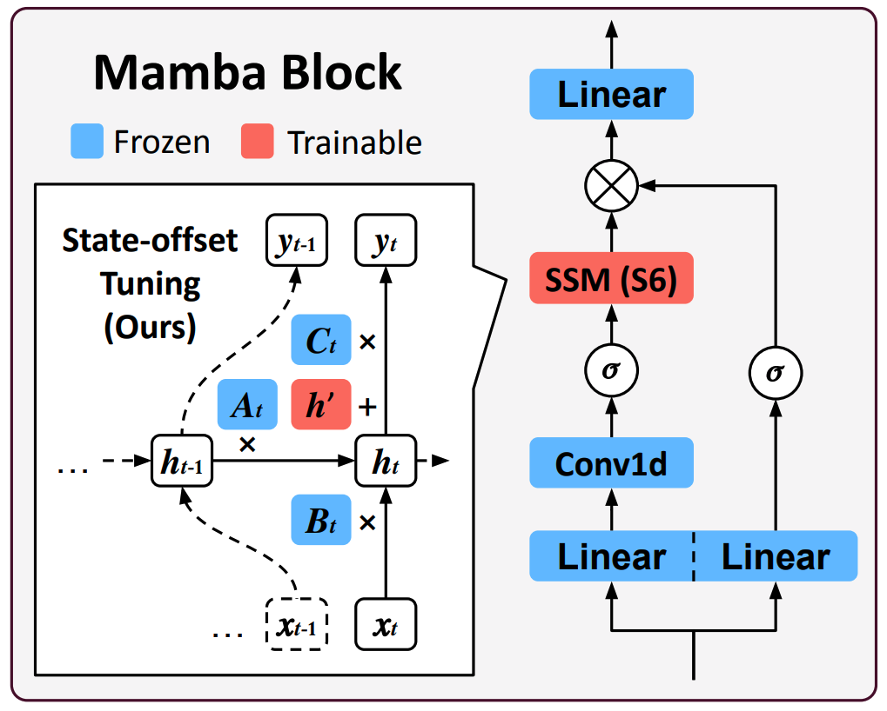

<h1 align="center"> <p>State-offset Tuning: State-based Parameter-Efficient Fine-Tuning for State Space Models</p></h1>
<h4 align="center">
    <p>
      <a href="https://scholar.google.com/citations?user=Q-ARWkwAAAAJ&hl=eh" target="_blank">Wonjun Kang</a><sup>1,2*</sup>, <a href="https://scholar.google.com/citations?user=G1EpeWYAAAAJ&hl=en" target="_blank">Kevin Galim</a><sup>2*</sup>, <a href="https://yzeng58.github.io/zyc_cv/" target="_blank">Yuchen Zeng</a><sup>3*</sup>, <a href="https://scholar.google.com/citations?user=XJXKp60AAAAJ&hl=en" target="_blank">Minjae Lee</a><sup>2</sup>, <a href="http://cvml.ajou.ac.kr/wiki/index.php/Professor" target="_blank">Hyung Il Koo</a><sup>2,4</sup>, <a href="https://ece.snu.ac.kr/en/research-faculty/faculty/fulltime?md=view&profid=p041" target="_blank">Nam Ik Cho</a><sup>1</sup>
  </p>
  <p>
    <sup>1</sup><a href="https://en.snu.ac.kr/index.html" target="_blank">Seoul National University</a>, <sup>2</sup><a href="https://furiosa.ai/" target="_blank">FuriosaAI</a>, <sup>3</sup><a href="https://www.wisc.edu/" target="_blank">UW-Madison</a>, <sup>4</sup><a href="https://www.ajou.ac.kr/en/index.do" target="_blank">Ajou University</a>
   </p>
    </h4>

<p align="center">
    <a href="https://arxiv.org/abs/2503.03499">
        
    </a>
</p>


**Paper Link**: [arXiv](https://arxiv.org/abs/2503.03499)

<p align="center">
  
</p>

State Space Models (SSMs) have emerged as efficient alternatives to Transformers, mitigating their quadratic computational cost. However, the application of Parameter-Efficient Fine-Tuning (PEFT) methods to SSMs remains largely unexplored. In particular, prompt-based methods like Prompt Tuning and Prefix-Tuning, which are widely used in Transformers, do not perform well on SSMs. To address this, we propose **state-based methods** as a superior alternative to prompt-based methods. This new family of methods naturally stems from the architectural characteristics of SSMs. State-based methods adjust state-related features directly instead of depending on external prompts. Furthermore, we introduce a novel state-based PEFT method: **State-offset Tuning**. At every timestep, our method directly affects the state at the current step, leading to more effective adaptation. Through extensive experiments across diverse datasets, we demonstrate the effectiveness of our method.

## Updates

* [03/05/25] Code released.

### Setup
- Install dependencies
    ```bash
    # Create env
    conda create -n mamba-ssm python=3.10
    conda activate mamba-ssm

    # Install pytorch, e.g.,
    conda install pytorch==1.13.1 torchvision==0.14.1 torchaudio==0.13.1 pytorch-cuda=11.6 -c pytorch -c nvidia

    pip install "numpy<2"

    # Install mamba
    pip install "causal-conv1d==1.2.0.post2"
    cd src/mamba
    pip install -e . --no-build-isolation
    cd -

    # Install requirements
    pip install -r requirements.txt
    pip install peft==0.9.0 accelerate --no-deps
    ```

- For Spider evaluation, download [Spider](https://drive.usercontent.google.com/download?id=1403EGqzIDoHMdQF4c9Bkyl7dZLZ5Wt6J&export=download&authuser=1) and extract to "data/xlangai_spider/spider"

### Run
```bash
# train
python run_all.py train.py --device 0 --cfg cfg/final/exps/mamba-*/*/*.yaml
```
